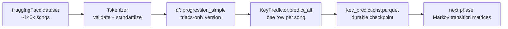

# chordal\_wip — Module &amp; Method Overview

One-liners for future-you. Last updated: October 2026, after refactoring Steps 1–7.  
Everything below keeps the test suite green; every change was one git commit.

## The Big Picture

**The end goal** (why key prediction exists at all): the transition matrices will be built in _degree space_ (I, ii, V, bVII, ...), not absolute chord space, so that one genre-specific matrix works in every key. Converting songs to degree space needs a tonic label per song — that's what `key.py` produces, and why its error rate matters.

## scales.py — musical reference data

| Name                                       | What it does                                                                                                                                                                          |
| ------------------------------------------ | ------------------------------------------------------------------------------------------------------------------------------------------------------------------------------------- |
| `DEFAULT_CHORD_PROFILE`                    | Weight per diatonic chord `[tonic, ii, iii, IV, V, vi, vii]`; flat beyond the tonic on purpose. Alternative candidate (`KRUMHANSL_PROFILE`) noted in the comment — benchmark decides. |
| `MODES`                                    | The two modes the predictor knows: `("ionian", "aeolian")`.                                                                                                                           |
| `Scale`                                    | Note collection for a (tonic, mode); `Scale.ALL_NOTES` = the 12 canonical names (sharps spelling, e.g. `A#` not `Bb`).                                                                |
| `Chord`                                    | Diatonic chords of a scale; `Chord(Scale(key, mode)).data["triads"]` = the 7 triad names.                                                                                             |
| `generate_ref_scales(profile, chord_type)` | Builds the 24-row reference table: one row per (mode, tonic) with a `chord_weights` dict per row.                                                                                     |
| `get_ref_scales()`                         | `@functools.cache` accessor — computes once, then returns the _same_ DataFrame. **Contract: read-only; copy before modifying.**                                                       |

## key.py — key prediction

| Name                  | What it does                                                                                                                                                                                                                         |
| --------------------- | ------------------------------------------------------------------------------------------------------------------------------------------------------------------------------------------------------------------------------------ |
| `NOTE_TO_PITCH_CLASS` | Maps note names to 0–11, so distances between tonics can be _measured_.                                                                                                                                                              |
| `_softmax(x)`         | Scores → probabilities summing to 1. Module-level: needs no class state.                                                                                                                                                             |
| `key_relation(a, b)`  | Classifies two keys: `exact / relative / parallel / fifth / other`. Uses _circular_ distance — `min(d, 12 - d)`, the naive `abs()` version was buggy. `exact` only occurs prediction-vs-ground-truth, never between top-1 and top-2. |

**`KeyPrediction`** (dataclass — one prediction with all diagnostics):

| Field / property           | Meaning                                                                                                                          |
| -------------------------- | -------------------------------------------------------------------------------------------------------------------------------- |
| `tonic`, `mode`            | The winning key, kept as two fields (never parse `"A ionian"` back apart).                                                       |
| `probs`                    | Softmax probability for all 24 reference keys; sums to 1.                                                                        |
| `n_chords`, `oov_fraction` | Input size; fraction of chords outside the vocabulary (trust signal).                                                            |
| `label`                    | `"A ionian"` — derived on the fly (`@property`).                                                                                 |
| `confidence`               | Probability of the winner. **Nearly useless** — softmax flattening keeps it around 0.1–0.3 even for clear songs.                 |
| `margin`                   | Relative gap to the runner-up (0 = perfect tie, e.g. `Cmaj Am Fmaj Gmaj` → C ionian vs A aeolian). **This is the trust signal.** |

**`KeyPredictor`**:

| Method                     | What it does                                                                                                                                                                                                                                  |
| -------------------------- | --------------------------------------------------------------------------------------------------------------------------------------------------------------------------------------------------------------------------------------------- |
| `__init__(reference=None)` | Builds the sparse weight matrix. `reference` injection point exists so the benchmark can sweep chord profiles without monkeypatching.                                                                                                         |
| `predict(chords)`          | Full prediction → `KeyPrediction`, or `None` if empty / all-OOV (refuse, never silently guess).                                                                                                                                               |
| `predict_key(chords)`      | Thin wrapper returning just the label; kept so old call sites work.                                                                                                                                                                           |
| `predict_all(series)`      | Bulk: Series(song\_id → progression) → DataFrame with `RESULT_COLUMNS` (label, p\_top1, label\_top2, top2\_relation, margin, oov\_fraction, n\_chords). Ties resolved with the same tiebreak as `predict()` (`stable=True, descending=True`). |
| `RESULT_COLUMNS`           | The output schema contract of `predict_all`, written down once.                                                                                                                                                                               |
| `ref_keys`                 | `(tonic, mode)` per reference row — fast lookups in the hot loop.                                                                                                                                                                             |

## Design decisions worth remembering

- **Benign vs harmful errors.** Confusing relative major/minor keys (C ionian ↔ A aeolian) is benign — same chords, only "home" differs. Confusing anything else is not. `key_relation` + `top2_relation` exist to measure this.
- **`margin` over `confidence`.** See the table above; don't build filters on `confidence`.
- **Refuse, don't guess.** Empty or all-OOV input → `None`, never a confident-looking wrong answer.
- **Loud failures.** Unknown note names raise `KeyError`; wrong profile lengths hit an `assert`; unknown kwargs raise `TypeError`. Silent wrongness is the only real enemy.
- **Read-only shared data.** The cached reference DataFrame is shared; anyone mutating it poisons the cache for everyone.
- **Stability where ties matter.** `np.argmax` picks the first maximum, so the top-2 sort must be stable-and-descending to agree with it.

## Open items / roadmap

- **Benchmark (current step).** Isophonics/Beatles annotations (\~180 songs, expert-labeled chords _and_ keys). Produces: accuracy by relation, MIREX-style weighted score, margin calibration per decile. Adjudicates everything below.
- **Step 5 — `lam_first` / `lam_last`** (first/last-chord boost): deferred until the benchmark can tune it.
- **`DEFAULT_CHORD_PROFILE` vs `KRUMHANSL_PROFILE`:** benchmark decides; sweep via the `reference` injection point.
- **Next phase.** Degree-space conversion (transpose to canonical tonic incl. chromatic degrees like `bVII`), then per-genre Markov transition matrices; low-`margin` songs get dropped or fractionally assigned between relative pairs.
